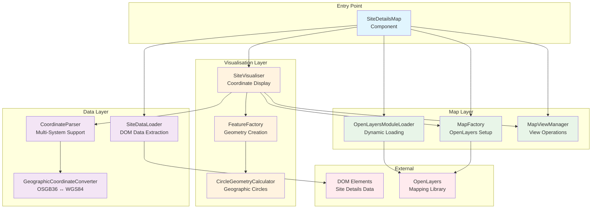

# Site Details Map Module

Mapping of marine licensing site coordinates using OpenLayers. This module supports multiple coordinate systems, file uploads, and manual coordinate entry for displaying site boundaries on an interactive map.

## Architecture Overview



## Coordinate System Support

### **WGS84 (World Geodetic System 1984)**

- **Format**: Decimal degrees (latitude, longitude)
- **Example**: `51.550000, 0.700000`
- **Use Case**: GPS coordinates, international standards

### **OSGB36 (Ordnance Survey Great Britain 1936)**

- **Format**: Eastings and northings in metres
- **Example**: `577000, 178000`
- **Use Case**: UK mapping, marine licensing submissions

### **Web Mercator (EPSG:3857)**

- **Format**: Projected coordinates in metres
- **Use Case**: Web mapping display (internal use)

## Feature Types

### **Circular Sites**

Centre point with radius, displayed as accurate geographic circles

```javascript
// Example data structure
{
  coordinateSystem: 'WGS84',
  coordinates: { latitude: '51.5', longitude: '-0.1' },
  circleWidth: '500' // metres diameter
}
```

### **Polygon Sites**

Multiple coordinates forming site boundaries

```javascript
// Example data structure
{
  coordinateSystem: 'WGS84',
  coordinatesEntry: 'multiple',
  coordinates: [
    { latitude: '51.55', longitude: '0.70' },
    { latitude: '51.52', longitude: '1.00' },
    { latitude: '51.45', longitude: '1.10' }
  ]
}
```

### **File Upload Sites**

GeoJSON data from uploaded shapefiles or KML files

```javascript
// Example GeoJSON structure
{
  type: 'FeatureCollection',
  features: [
    {
      type: 'Feature',
      geometry: { type: 'Polygon', coordinates: [[...]] },
      properties: {}
    }
  ]
}
```
