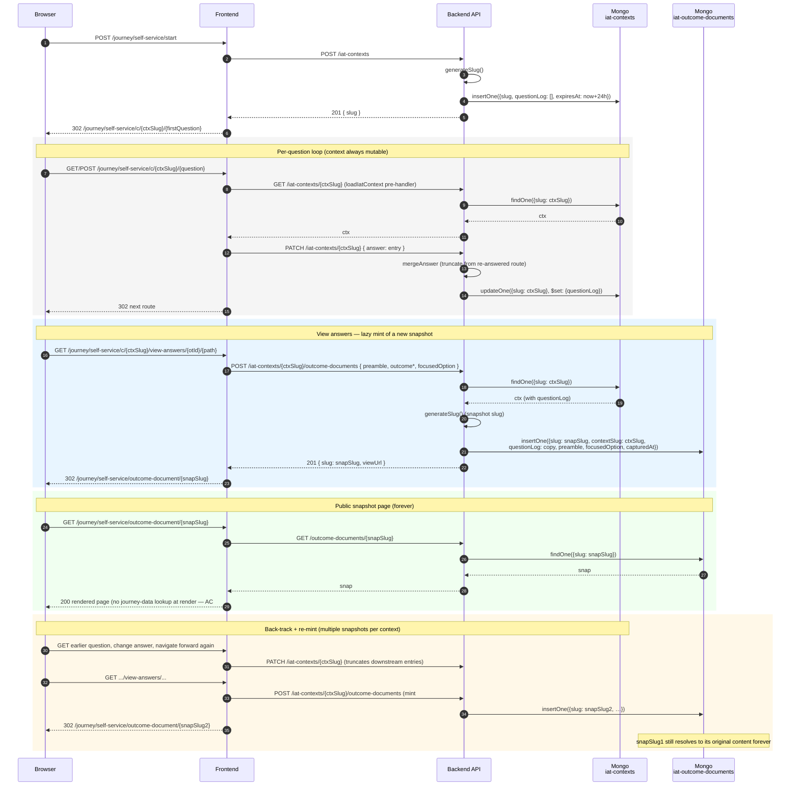

# Interactive Assistance Tool (IAT)

The Marine Licence Interactive Assistance Tool is a decision-tree
walkthrough that helps members of the public determine whether their
planned marine activity needs a marine licence. It is anonymous (no Defra
ID) and driven entirely by a JSON configuration file.

This README is the top-level entry point for IAT engineers. For the
deeper-dive areas, see:

- [`data/README.data.md`](./data/README.data.md) — the `self-service.json`
  configuration model: question/outcome/outcomeType schema, the multiSelect
  rules, the five journey phases, HTML sanitisation expectations.
- [`services/README.data-quality.md`](./services/README.data-quality.md) —
  the load-time and runtime config-defect logger
  (`runLoadTimeScan` / `reportRuntimeIssue`), its ECS log shape, and the
  bounded `seenRuntimeIssues` set.
- [`README.iat-query.md`](./README.iat-query.md) — the `npm run iat`
  developer CLI for inspecting `self-service.json`: node inspect/list
  commands and the `path` / `reach` / `predecessors` graph traversal.

## File map

```
src/server/journey/self-service/
├── start/             # GET/POST /journey/self-service/start                                 (ML-1162)
├── invalid/           # GET      /journey/self-service/invalid                               (ML-1306)
├── question/          # GET/POST /journey/self-service/c/{slug}/{questionPath*}              (ML-1186, ML-1304/1306)
├── outcome/           # GET/POST /journey/self-service/c/{slug}/outcome/{outcomePath*}       (ML-1164, ML-1304/1306)
│                      # GET      /journey/self-service/c/{slug}/view-answers/{...}           (ML-1165, ML-1304/1306)
│                      # GET      /journey/self-service/c/{slug}/continue/{...}                (ML-1166)
├── outcome-document/  # GET      /journey/self-service/outcome-document/{snapshotSlug}        (ML-1306)
├── data/              # self-service.json + load-time parser/sanitiser
└── services/          # journey-data, journey-router, journey-answer-log,
                       # load-iat-context, data-quality, sanitise
```

The IAT uses **two distinct slugs** living in **two distinct Mongo
collections** — each named in lower-case kebab plural to match repo
convention:

- A **context slug** identifies the user's per-tab walkthrough
  (`iat-contexts` collection, 24h TTL). It appears in every `c/{slug}/…`
  URL while the user is navigating.
- A **snapshot slug** identifies an immutable "View answers" snapshot
  (`iat-outcome-documents` collection, no TTL — permanent). It appears
  only in the public `/journey/self-service/outcome-document/{slug}` URL.

Both are 22-char base64url UUIDv7s generated server-side. They never
overlap and never coexist on the same URL.

Note: `session-answers.js`, `iat-answers-payload.js`, `iat-answers-service`,
and the old `answer/` directory are all GONE. The current modules are
`journey-answer-log`, `load-iat-context`, plus the two-service split under
`src/services/iat-service/` (`iat-context.service.js` and
`iat-outcome-document.service.js`).

All route plugins are registered conditionally in
[`src/server/router.js`](../../router.js) when `selfService.enabled` is
true. Frontend routes are `auth: false`; backend `/iat-contexts` and
`/outcome-documents` endpoints run with `auth: { mode: 'optional' }`.

## Routes

| Method | Path                                                                         | Purpose                                                                                                                                                                                                               | Source              |
| ------ | ---------------------------------------------------------------------------- | --------------------------------------------------------------------------------------------------------------------------------------------------------------------------------------------------------------------- | ------------------- |
| GET    | `/journey/self-service/start`                                                | Pre-walkthrough landing page                                                                                                                                                                                          | `start/`            |
| POST   | `/journey/self-service/start`                                                | Mint a context slug; redirect to first question under slug-prefixed URL                                                                                                                                               | `start/`            |
| GET    | `/journey/self-service/invalid`                                              | "This check has expired or could not be found" page                                                                                                                                                                   | `invalid/`          |
| GET    | `/journey/self-service/c/{slug}/{questionPath*}`                             | Render a question; pre-select answers from the context's questionLog                                                                                                                                                  | `question/`         |
| POST   | `/journey/self-service/c/{slug}/{questionPath*}`                             | PATCH the context's questionLog with the new answer entry, redirect to next node                                                                                                                                      | `question/`         |
| GET    | `/journey/self-service/c/{slug}/outcome/{outcomePath*}`                      | Render outcome (intermediate fork, terminal-single, or terminal-multi). No mint — view only.                                                                                                                          | `outcome/`          |
| POST   | `/journey/self-service/c/{slug}/outcome/{outcomePath*}`                      | Intermediate selection — PATCH chosen outcomeType into questionLog, redirect to its `nextQuestionRoute`                                                                                                               | `outcome/`          |
| GET    | `/journey/self-service/c/{slug}/view-answers/{outcomeTypeId}/{outcomePath*}` | **Mint** a new outcome-document snapshot from the current context + focused outcomeType; 302 to `/journey/self-service/outcome-document/…`                                                                            | `outcome/`          |
| GET    | `/journey/self-service/c/{slug}/continue/{outcomeTypeId}/{outcomePath*}`     | **Mint** a snapshot, then hand off to the exemption journey: 302 to the focused outcomeType's `overrideCtaButtonUrl` with the answers passed as a query string. 404 if the outcomeType has no `overrideCtaButtonUrl`. | `outcome/`          |
| GET    | `/journey/self-service/outcome-document/{slug}`                              | Render an immutable snapshot. Public, permanent, slug-only — no context required.                                                                                                                                     | `outcome-document/` |

The catch-all paths on question and outcome resolve through
`services/journey-data.js` and `services/journey-router.js`; see
[`data/README.data.md`](./data/README.data.md) for the routing rules.

`view-answers` and `continue` both **mint** an immutable snapshot from the
current context — they differ only in where they send the user next.
`view-answers` redirects to the public snapshot page; `continue` (ML-1166)
hands off into the Defra exemption application journey, redirecting to the
focused outcomeType's `overrideCtaButtonUrl` with the answers (and a link
back to the snapshot) as a query string. Only outcomeTypes that carry an
`overrideCtaButtonUrl` are valid `continue` targets.

## Request lifecycle

A walkthrough has **two independent lifecycles**, one per collection.

**`iat-contexts` — the in-flight session (24h TTL, always mutable).**
Created on POST to `/journey/self-service/start`. Holds the running
`questionLog` of answers as the user navigates. Mutated freely as the
user answers and back-tracks — there is no "publish" or "freeze" step
on this collection. Auto-deletes 24h after creation via Mongo TTL.

**`iat-outcome-documents` — immutable snapshot (no TTL, permanent).**
Created lazily on each click of "View answers". Each mint copies the
current questionLog, preamble, outcome heading/text, and focused
outcomeType verbatim into a brand-new document with its own slug. The
snapshot is self-contained — its render path never reads from
`self-service.json`. The context doc is untouched by the mint.

This decoupling is the headline ML-1306 design change. The legacy
single-collection / publish-once model was replaced because the Fivium
MCMS reference behaviour requires that a user can back-track, change
answers, click "View answers" again, and get a **different** permanent
URL — without the original URL changing or disappearing. Multiple
snapshots per context are normal and expected.



The pre-handler [`services/load-iat-context.js`](./services/load-iat-context.js)
runs on every `c/{slug}/…` route — it fetches the context doc via the
backend, redirects to `/journey/self-service/invalid` on missing-or-expired,
and stashes the doc on `request.app.iatDoc` for the handler.

## Backend contract

The backend exposes five endpoints across two routers, all
`auth: { mode: 'optional' }`. Source: `marine-licensing-backend/src/iat-contexts/`
and `marine-licensing-backend/src/iat-outcome-documents/`.

| Backend route                            | Method | Purpose                                                                                                |
| ---------------------------------------- | ------ | ------------------------------------------------------------------------------------------------------ |
| `/iat-contexts`                          | POST   | Insert empty context with server-generated slug and `expiresAt = now + 24h`                            |
| `/iat-contexts/{slug}`                   | GET    | Return the context body (`_id` stripped). Used by `loadIatContext` pre-handler.                        |
| `/iat-contexts/{slug}`                   | PATCH  | Append-or-truncate a `questionLog` entry. Back-track truncates downstream entries via `mergeAnswer()`. |
| `/iat-contexts/{slug}/outcome-documents` | POST   | **Mint** a new immutable snapshot from the context + payload. Returns `{slug, viewUrl, snapshot}`.     |
| `/outcome-documents/{slug}`              | GET    | Return a snapshot body (`_id` stripped). Public, permanent.                                            |

Both slugs are 22-character base64url encodings of UUIDv7s (RFC 9562):
48-bit timestamp prefix, 74 bits of random, 4 version bits, 2 variant
bits — 128 bits in the URL alphabet. Generated server-side only — the
frontend never sees the algorithm. The UUIDv7 time prefix is load-bearing
for Mongo B-tree index locality on the unique-slug index; the unit test
in `iat-shared/helpers/generate-slug.test.js` asserts the version nibble
and variant bits to catch a regression to UUIDv4.

### Mutability rules

- The **context** doc is **always mutable** while it exists — there is
  no "published" flag, no `$unset`, no freeze step. PATCH can be called
  any number of times. Back-tracking + re-answering truncates the
  questionLog from the re-answered route forward
  ([`mergeAnswer` in `patch-iat-context.js`](../../../../../marine-licensing-backend/src/iat-contexts/api/controllers/patch-iat-context.js)).
- The **snapshot** doc is **immutable from creation** — there is no
  PATCH / PUT endpoint on `/outcome-documents`. Only `POST` (mint, via
  the context router) and `GET` exist.
- The two slugs are **independent**. The context slug appears in every
  `c/{slug}/…` URL; the snapshot slug appears only in
  `/outcome-documents/{slug}`. They are never reused or swapped.
- The same context can mint **many** snapshots — every "View answers"
  click produces a new one. Old snapshot URLs continue to serve their
  original content forever, regardless of what the user does next in
  the same context.

### Question-log entry shape

A `questionLog` entry on a context (and copied verbatim into a snapshot)
is:

```js
{
  questionRoute: '/sea',
  questionText: 'Where will the activity take place?',  // frozen at write time
  answers: [{ id: 'inSea', text: 'In the sea' }],       // 1+ entries (multi-select)
  mcmsAppFormMapping: null,                             // or 'ACTIVITY_TYPE' etc.
  answeredAt: ISODate('...')
}
```

`questionText` and `answers[].text` are **frozen at write time** from
the JSON's current value — the snapshot doc therefore renders correctly
even after `self-service.json` is wholly replaced (AC#6, verified by
the JSON-replacement test in
[`outcome-document/controller.test.js`](./outcome-document/controller.test.js)).

### Snapshot doc shape

```js
{
  slug: '<22 char base64url>',
  contextSlug: '<the context that minted this>',
  preamble: 'The purpose of the MMO marine licence requirement checker tool…',  // from JSON, frozen
  questionLog: [ ...entries above, verbatim copy ],
  outcomeRoute: '/outcome-a',
  outcomeKind: 'terminal-single' | 'terminal-multi' | 'intermediate',
  outcomeHeading: '…',
  outcomeText: '…',
  focusedOption: { id, heading, text, module, link, overrideCtaButtonUrl, params },
  capturedAt: ISODate('...'),
  createdBy: null | '<defraId UUID>',                   // nullable — IAT is anonymous
  createdAt: ISODate('...')
}
```

## Config flags

| Key                              | Env var                   | Default | Effect                                                                                                                                          |
| -------------------------------- | ------------------------- | ------- | ----------------------------------------------------------------------------------------------------------------------------------------------- |
| `selfService.enabled`            | `ENABLE_SELF_SERVICE`     | `false` | Registers the IAT route plugins and the data-quality init plugin. When false, all IAT URLs return 404.                                          |
| `selfService.dataQualityEnabled` | `ENABLE_IAT_DATA_QUALITY` | `false` | Runs `runLoadTimeScan` on Hapi `start` to log defects in `self-service.json`. Runtime defect logging in handlers is **not** gated by this flag. |
| `iat.inFlightTtlMs`              | `IAT_IN_FLIGHT_TTL_MS`    | 24h     | Sets the `expiresAt` value written on context creation. Mongo's TTL monitor deletes the doc that many ms after that timestamp.                  |

## Querying `self-service.json`

The JSON is large (~5000 lines) and relational. Use the in-repo CLI
(`npm run iat`) rather than ad-hoc grep/jq — it reuses the same
parsed/sanitised view the running app sees and the real router, so what you
see matches what runs. It can inspect a single node, filter the lists, and
**traverse the journey graph** (`path` / `reach` / `predecessors`).

```bash
# How does a user actually reach a page?
npm run iat -- path /mod-permission
# Inspect one question and where each answer branches to
npm run iat -- question /activity-type
```

Full subcommand reference, the graph model, exit codes, `--json` contract,
and the source-file map live in **[`README.iat-query.md`](./README.iat-query.md)**.

## Security: defence in depth

The IAT's threat model is unusual: the routes are public-by-design (no
Defra ID), and snapshot URLs are _intentionally_ shareable — they get
linked from the public ArcGIS map layer that already publishes exemption
locations, and will do the same for marine licences when those go live.
That makes some controls (auth, session-bound capability tokens) wrong
for the surface, and shifts the weight onto input validation, sanitisation,
and immutability of public-record artefacts.

The layers below are listed roughly outermost-first. Each row names what
it actually defends against — and, where useful, what it does _not_
defend against, so a reader doesn't infer protection that isn't there.

| #   | Defense                                                                                                  | Where                                                                                                                                                                                                                                                                                                                                                                                            | Defends against                                                                                                                                                                                                                                                                                                                        |
| --- | -------------------------------------------------------------------------------------------------------- | ------------------------------------------------------------------------------------------------------------------------------------------------------------------------------------------------------------------------------------------------------------------------------------------------------------------------------------------------------------------------------------------------ | -------------------------------------------------------------------------------------------------------------------------------------------------------------------------------------------------------------------------------------------------------------------------------------------------------------------------------------- |
| 1   | `selfService.enabled` feature flag                                                                       | [`src/server/router.js`](../../router.js)                                                                                                                                                                                                                                                                                                                                                        | Accidental exposure of an incomplete IAT before launch (the plugins are simply not registered when the flag is off).                                                                                                                                                                                                                   |
| 2   | Joi slug validation `Joi.string().length(22).pattern(/^[A-Za-z0-9_-]{22}$/)` on every slug-bearing route | [`outcome-document/index.js`](./outcome-document/index.js), [`question/index.js`](./question/index.js), [`outcome/index.js`](./outcome/index.js), and backend [`iat-context.js`](../../../../../marine-licensing-backend/src/iat-contexts/models/iat-context.js) + [`iat-outcome-document.js`](../../../../../marine-licensing-backend/src/iat-outcome-documents/models/iat-outcome-document.js) | Path traversal, NoSQL injection, and odd-charset trickery via the `{slug}` URL param. Joi rejects with 400 before the controller runs. The catch-all `{questionPath*}` segment is also capped at 200 chars to bound the input the data-quality logger keys on.                                                                         |
| 3   | 22-char base64url UUIDv7 slug as URL capability                                                          | [`marine-licensing-backend/src/iat-shared/helpers/generate-slug.js`](../../../../../marine-licensing-backend/src/iat-shared/helpers/generate-slug.js)                                                                                                                                                                                                                                            | Guessing or enumerating snapshot URLs (74 bits of random plus a 48-bit timestamp the attacker would also need to hit, which together make brute force infeasible). The same scheme protects context URLs (`c/{slug}/…`).                                                                                                               |
| 4   | Snapshot collection has **no** PATCH/PUT endpoint                                                        | [`marine-licensing-backend/src/iat-outcome-documents/api/index.js`](../../../../../marine-licensing-backend/src/iat-outcome-documents/api/index.js)                                                                                                                                                                                                                                              | Tampering with a published snapshot. Only `GET` is exposed on `/outcome-documents/{slug}`. The mint endpoint sits under the context router and creates a **new** doc — it cannot overwrite an existing one (a server-generated unique slug + duplicate-key retry guarantees this).                                                     |
| 5   | Mongo TTL index on `iat-contexts.expiresAt`                                                              | [`marine-licensing-backend/migrations/20260526151453-iat-contexts.js`](../../../../../marine-licensing-backend/migrations/20260526151453-iat-contexts.js)                                                                                                                                                                                                                                        | Indefinite storage growth from abandoned walkthroughs. Context docs auto-delete 24h after `expiresAt`. The snapshot collection has **no** TTL — those persist forever by design.                                                                                                                                                       |
| 6   | Identical HTTP response for unknown / expired context or unknown snapshot                                | [`services/load-iat-context.js`](./services/load-iat-context.js), [`get-outcome-document.js`](../../../../../marine-licensing-backend/src/iat-outcome-documents/api/controllers/get-outcome-document.js)                                                                                                                                                                                         | Information disclosure via differing error pages — an attacker probing slugs cannot distinguish "never existed" from "expired" from "snapshot from a different context" via the HTTP response.                                                                                                                                         |
| 7   | Snapshot is self-contained — render never reads `self-service.json`                                      | [`outcome-document/controller.js`](./outcome-document/controller.js), enforced by the JSON-replacement test in [`outcome-document/controller.test.js`](./outcome-document/controller.test.js)                                                                                                                                                                                                    | Replacement of `self-service.json` cannot retroactively change historical snapshot content. The text on each snapshot is what it was at mint time. Also: an attacker who got a foothold to edit the JSON cannot use that foothold to alter the meaning of older public URLs.                                                           |
| 8   | Frontend sanitisation of `self-service.json` content at load time                                        | [`services/sanitise.js`](./services/sanitise.js), applied by `services/journey-data.js` to `question.hint`, `answer.hint`, `outcome.text`, `outcomeType.text`, with `stripHtml` on `question.text` and `section.text`                                                                                                                                                                            | Stored XSS from configuration content rendered into the IAT pages. The same allowlist applies to every place the JSON content flows — into question/outcome pages directly, and into snapshot docs at mint time.                                                                                                                       |
| 9   | Frontend re-sanitisation of `summaryText` and `questionText` on the snapshot page                        | [`outcome-document/index.njk`](./outcome-document/index.njk) (`\| sanitiseRichText` on both the focusedOption text and each questionLog entry's frozen questionText)                                                                                                                                                                                                                             | Defence in depth — even though the text was sanitised at JSON load (layer 8), the snapshot is re-sanitised at render so a hypothetical mongo-direct write cannot leak unsanitised HTML through the public page.                                                                                                                        |
| 10  | No PII in the context or snapshot doc body                                                               | [`question/controller.js` `buildAnswerPayload`](./question/controller.js) — entries carry `{questionRoute, questionText, answers: [{id,text}], mcmsAppFormMapping}` only; no name, email, IP, or session ID; `createdBy` is either `null` (anonymous, the common case) or a DefraID UUID if the user is signed in.                                                                               | Accidental publication of personal data when the snapshot URL is shared or indexed. The doc carries the user's question/answer trail (with frozen wording, needed for AC#6) and the rendered outcome text — nothing else. Note that the shape changed in ML-1306: text is now stored in the doc, not resolved at render — see layer 7. |
| 11  | Bounded `seenRuntimeIssues` Set (FIFO, 100 entries)                                                      | [`services/data-quality.js`](./services/data-quality.js), see [`services/README.data-quality.md`](./services/README.data-quality.md)                                                                                                                                                                                                                                                             | Process-level memory growth from anonymous traffic that hits a malformed-config branch. Required because the runtime callers are reachable on `auth: false` routes.                                                                                                                                                                    |
